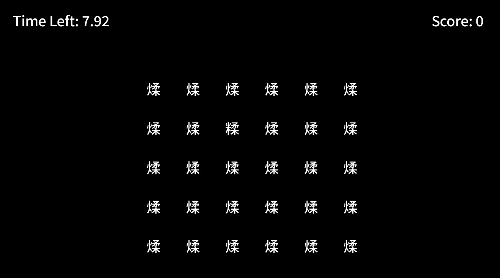

# Hanzi Frenzy
Author: ZiyuLi

Design: There are a lot of similar characters in Chinese hanzi, find the only different one in a grid of look-alike characters!

Text Drawing: All text is computed and rendered at runtime via the `render_text` function.

Choices: The choices of this game is independent of each other, so no fancy design is required.

Screen Shot:

How To Play:

Click on the character that you think is different from the rest before the time runs out!

Sources: Free font from Google font.

This game was built with [NEST](NEST.md).

